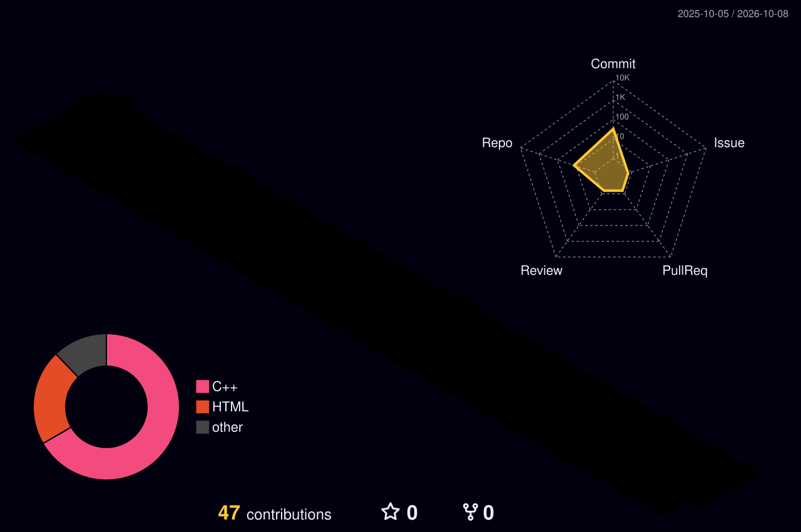

  

### Hi there, I'm Zia 👋

- 🎓 BS Artificial Intelligence student at University of Central Punjab, Lahore
- 🤖 Learning Machine Learning, Deep Learning and Python
- 🎯 Goal: become an AI Engineer
- 🌐 Portfolio: [m-zia-khalil.github.io/Portfolio](https://m-zia-khalil.github.io/Portfolio/)

 

### 🏙️ My Contributions in 3D

<picture>
  <source media="(prefers-color-scheme: dark)" srcset="profile-3d-contrib/profile-night-rainbow.svg" />
  <source media="(prefers-color-scheme: light)" srcset="profile-3d-contrib/profile-green-animate.svg" />
  
</picture>

### 🐍 Contributions

<picture>
  <source media="(prefers-color-scheme: dark)" srcset="https://raw.githubusercontent.com/m-zia-khalil/m-zia-khalil/output/github-snake-dark.svg" />
  <source media="(prefers-color-scheme: light)" srcset="https://raw.githubusercontent.com/m-zia-khalil/m-zia-khalil/output/github-snake.svg" />
  
</picture>

  

